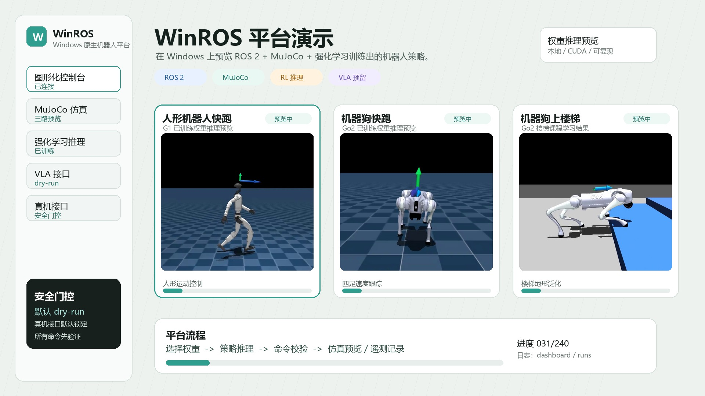

# WinROS

**Windows-first robotics learning platform for ROS 2, MuJoCo simulation, reinforcement learning, VLA dry-run, and real-robot adapters.**

WinROS provides a Windows-native entry point for robot learning workflows. The
project connects a local dashboard, lightweight simulation tasks, ROS 2
interfaces, reinforcement-learning utilities, VLA command providers, and
dry-run robot adapters in one repository.

The repository is designed for education, prototyping, and reproducible demos.
Large checkpoints, vendor SDKs, private datasets, calibration files, and
hardware credentials are intentionally kept outside Git.

## Demo

The current showcase includes three trained-policy previews:

- Unitree G1 fast running
- Unitree Go2 fast running
- Unitree Go2 stair climbing

<p align="center">
  <a href="docs/assets/demo/winros_showcase.webm">
    
  </a>
</p>

Demo page: [docs/demo/index.html](docs/demo/index.html)  
Demo notes: [docs/DEMO.md](docs/DEMO.md)  
Validation notes: [docs/VALIDATION.md](docs/VALIDATION.md)

## Project Scope

| Area | Current support |
| --- | --- |
| Windows setup | Conda and PowerShell helper scripts |
| Dashboard | Local web UI for simulation, checks, RL, VLA dry-run, and ROS 2 profiles |
| Simulation | MuJoCo runners and small built-in robot tasks |
| Reinforcement learning | SB3 utilities, scripted baselines, and Unitree MJLab demo recording tools |
| ROS 2 | Interface package, MuJoCo bridge package, and robot-adapter package |
| VLA | Provider interface that returns structured dry-run robot commands |
| Real robots | Adapter skeletons with dry-run-first safety boundaries |

## Quick Start

Create the environment:

```powershell
powershell -ExecutionPolicy Bypass -File .\scripts\setup_conda_env.ps1
. .\scripts\activate_winros.ps1
```

Open the dashboard:

```powershell
python -m winros --dashboard
```

Open the printed local URL, usually:

```text
http://127.0.0.1:8765
```

Run a minimal simulation:

```powershell
python -m winros --list-robots
python -m winros --robot two_link_arm --steps 1000
```

Run a VLA dry-run command:

```powershell
python -m winros --vla-provider rules --vla-robot "Unitree Go2" --vla-instruction "walk forward slowly"
```

Build the ROS 2 workspace:

```powershell
powershell -ExecutionPolicy Bypass -File .\scripts\build_ros2_ws.ps1
. .\scripts\activate_ros2_winros.ps1
ros2 pkg list | findstr winros
```

Chinese quickstart: [docs/QUICKSTART_ZH.md](docs/QUICKSTART_ZH.md)  
Beginner path: [docs/BEGINNER_PATH.md](docs/BEGINNER_PATH.md)

## Repository Layout

```text
.
|-- apps/dashboard/       # Dashboard notes
|-- configs/              # Platform, task, asset, and dashboard configuration
|-- docs/                 # Architecture, setup, validation, and interface docs
|-- requirements/         # Install profiles
|-- ros2_ws/              # ROS 2 interface, bridge, and adapter packages
|-- scripts/              # Windows helper scripts and demo recording tools
|-- sim/                  # MuJoCo models and simulation assets
|-- src/winros/           # Python CLI, dashboard, RL, VLA, and simulation utilities
`-- tests/                # Lightweight tests
```

## Documentation

| Document | Purpose |
| --- | --- |
| [Motivation](docs/WHY_WINROS.md) | Project goals and design boundaries |
| [Windows setup](docs/SETUP_WINDOWS.md) | Environment setup details |
| [Chinese quickstart](docs/QUICKSTART_ZH.md) | Minimal first-run path in Chinese |
| [Beginner path](docs/BEGINNER_PATH.md) | Suggested learning sequence |
| [Demo assets](docs/DEMO.md) | Demo generation and asset notes |
| [Validation](docs/VALIDATION.md) | Public validation and release checks |
| [Dashboard](docs/DASHBOARD.md) | Dashboard profiles and customization |
| [VLA interface](docs/VLA_INTERFACE.md) | VLA provider contract and command schema |
| [Real robots](docs/REAL_ROBOTS.md) | Dry-run adapter expectations and safety notes |
| [Roadmap](docs/ROADMAP.md) | Planned platform work |

## Safety Model

WinROS uses the same safety rule for simulation, VLA, RL, and hardware-facing
adapters:

1. Generate a structured command.
2. Validate mode, limits, and robot state.
3. Publish only through the configured ROS 2 or adapter boundary.

Hardware adapters must start in dry-run mode. Real execution should be enabled
only after the adapter provides telemetry, limit checks, watchdog behavior, and
explicit operator controls.

## Public Repository Policy

The public repository includes source code, configuration, documentation,
interfaces, scripts, tests, and lightweight demo media. The following items
should remain outside Git:

- training checkpoints and experiment logs;
- downloaded third-party repositories under `third_party/`;
- datasets and large model weights;
- vendor SDKs and private hardware tools;
- robot IP addresses, calibration files, credentials, and secrets.

## License

MIT. Third-party assets, datasets, model weights, robot SDKs, and private
calibration files keep their own licenses and should not be redistributed unless
their licenses explicitly allow it.
